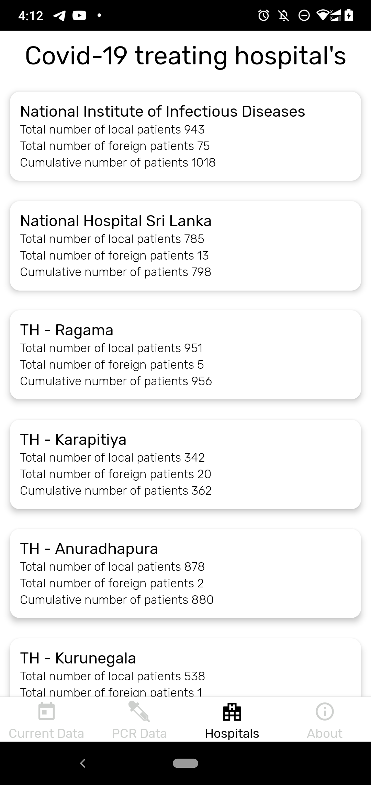

# Covid Data SL


## A simple application to visualize Covid-19 data

***

## Setup Procedure

Follow the React Native CLI [environment setup](https://reactnative.dev/docs/environment-setup)

### 1. Increase the amount of `inotify` watchers via the command below

* for `Debian/Redhat` based distros.

``` bash
    echo fs.inotify.max_user_watches=524288 | sudo tee -a /etc/sysctl.conf && sudo sysctl -p
  ```

* for `ArchLinux` distros.

``` bash
    echo fs.inotify.max_user_watches=524288 | sudo tee /etc/sysctl.d/40-max-user-watches.conf && sudo sysctl --system
  ```

### 2. Clone the repository in your desired location

``` bash
    git clone git@github.com:akmalahmed525/CovidDataSL.git
```

### 3. Install the `nvm` to manage a consistent `nodejs` environment

* Follow this [link]('https://github.com/nvm-sh/nvm') to install the nvm
* Install the `yarn` package manager

### 4. Install the dependencies

``` bash
    cd CovidDataSL && yarn
```

### 5. Create an `.env` file in the root directory by running the command below

``` bash
    cp .env.example .env
```

### 6. Run the `metro` server

``` bash
    yarn start
```

### 7. Connect a device/emulator & Run the command below

``` bash
    yarn android
```

> Note: The command install the development version of the app in the connected device.

### Screenshots

<table>
  <tr>
    <td valign="top"></td>
    <td valign="top"></td>
    <td valign="top"></td>
    <td valign="top"></td>
    <td valign="top"></td>
  </tr>
 </table>

<!-- 


 -->
